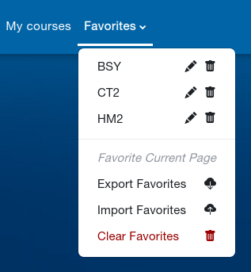
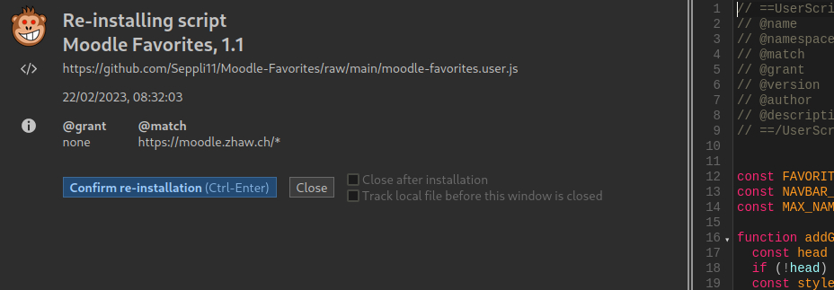

# Moodle-Favorites
A Moodle user script, which adds the ability to add favorite courses.

Feel free to contribute.

## Installation
To use this moodle script, a user script extension is required. Violentmonkey is a good choice for Chrome, Firefox and Edge. See [https://violentmonkey.github.io/get-it/](https://violentmonkey.github.io/get-it/)

| Browser | Installation                                                                                                       |
| ------- | ------------------------------------------------------------------------------------------------------------------ |
| Firefox | [Firefox Add-Ons Webstore](https://addons.mozilla.org/en-US/firefox/addon/violentmonkey/)                          |
| Chrome  | [Chrome Web Store](https://chrome.google.com/webstore/detail/violentmonkey/jinjaccalgkegednnccohejagnlnfdag?hl=en) |

When a user script extension is installed, go to [https://github.com/Seppli11/Moodle-Favorites/raw/main/moodle-favorites.user.js](https://github.com/Seppli11/Moodle-Favorites/raw/main/moodle-favorites.user.js). 
A page should open, which lets you install the script.

Once installled, the script will auto-update when a new version is available.